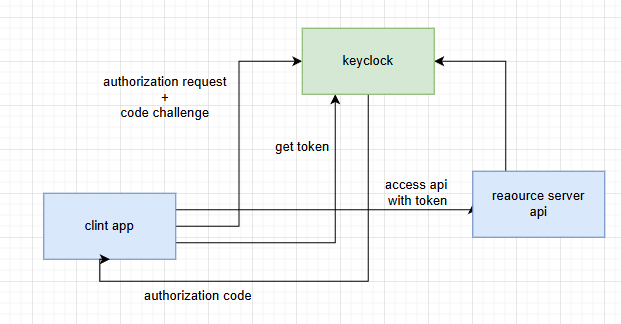
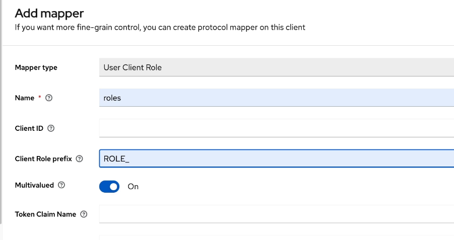

# Archetecture 
- we are using authorization code with pkce grant type to get the access token
- there are two services clint app and resource server (api)

# Getting Started

1. Run docker compose file `docker compose -up`
2. Go to keycloak console at `localhost:8085`
3. Create a realm named _`test`_
4. Create a user with password 
5. Create a client and make sure it is confidntial client
6. Create a role from client and name it `admin`
7. Assign this role to a user using role mappings
8. Go to the clint and create a new claim or mapper and name it `roles` 
9. Mapper type is user client role 
10. Add mapper specifc info 
11. Run two applications
12. To test app go to `localhost:8080/api/auth/flight`

