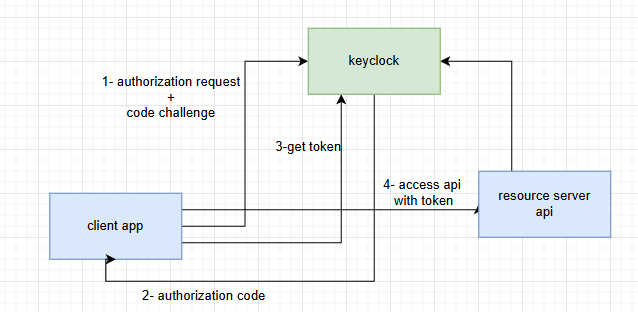
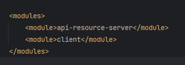
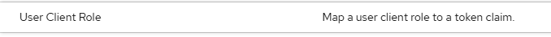
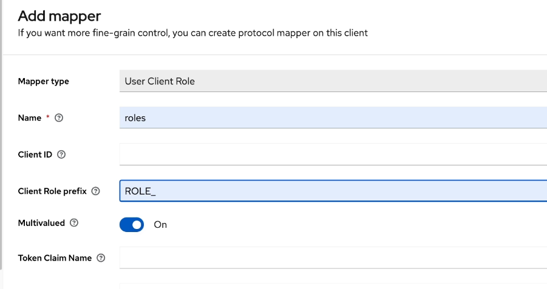

# Keycloak Demo: Authorization Code with PKCE
This repository contains a demo illustrating the concepts learned from a course on Keycloak, focusing on the Authorization Code with PKCE (Proof Key for Code Exchange) flow. The project consists of two main modules:

- Client Application: This module handles user authentication via Keycloak, acting as the Identity Management System (IMS). It initiates the authorization code flow with PKCE to ensure secure authentication.

- Resource Server API: This module serves as the resource server, responsible for verifying tokens issued by Keycloak and authorizing access to protected resources based on the validated tokens.

The demo provides a practical implementation of authenticating and authorizing users with Keycloak, showcasing how to securely manage access tokens and integrate them into a client-server architecture.

# Architecture 

- we are using authorization code with pkce grant type to get the access token
- there are two services client app and resource server (api)

 - using modular approach where i have two modules inside the main app

## prerequisites

- make sure you have docker installed in your machine

# Getting Started

1. Run docker compose file `docker compose -up`
2. Go to keycloak console at `localhost:8085`
3. Create a realm named _`test`_
4. Create a user with password 
5. Create a client and make sure it is confidntial client
6. Create a role from client and name it `admin`
7. Assign this role to a user using role mappings
8. Go to the clint and create a new claim or mapper and name it `roles` 
9. Mapper type is user client role 
10. Add mapper specifc info 
11. Run two applications
12. To test app go to `localhost:8080/api/auth/flight`

# technology stack 
- Spring boot 
- thymeleaf dependancy
- keycloak

